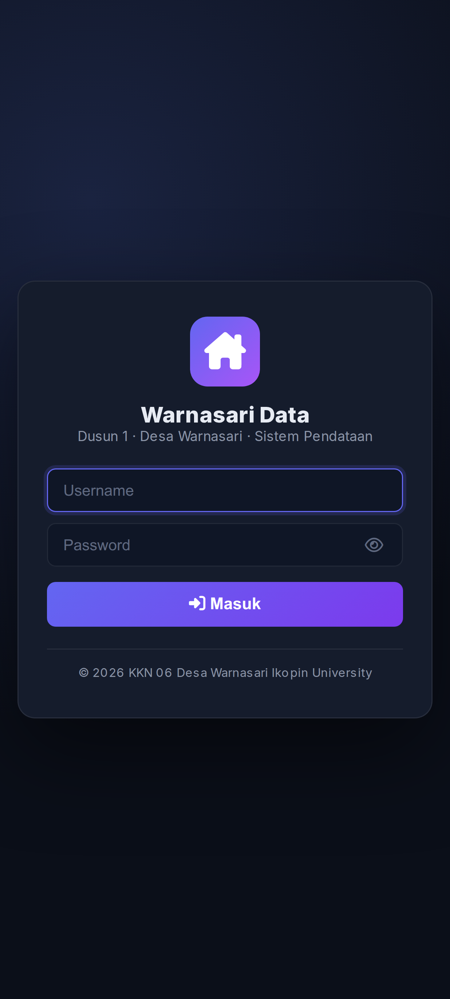
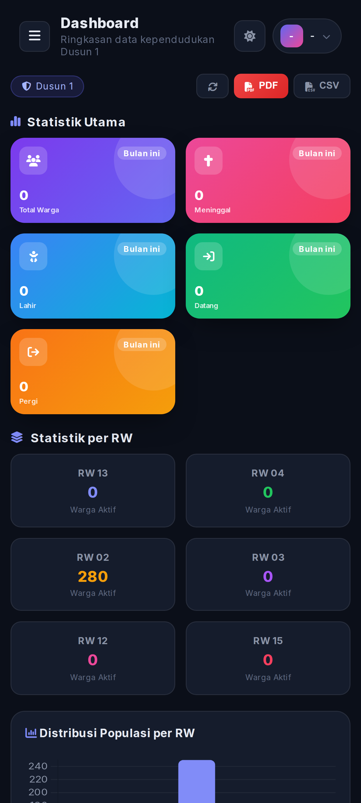
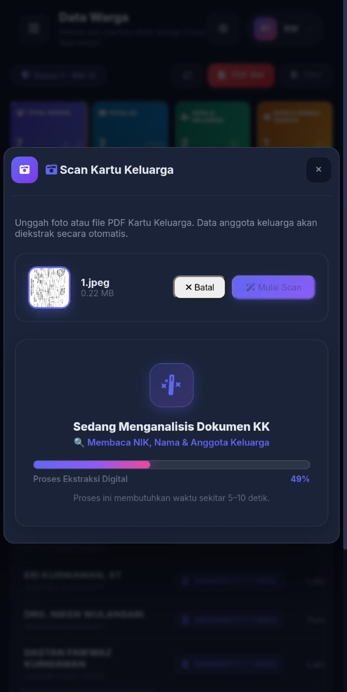
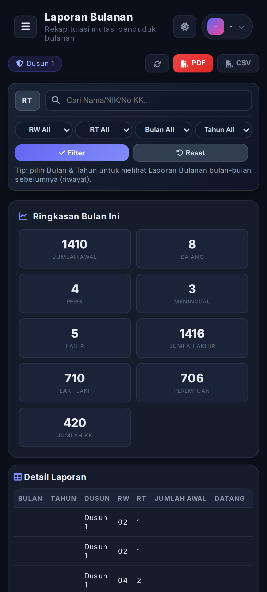
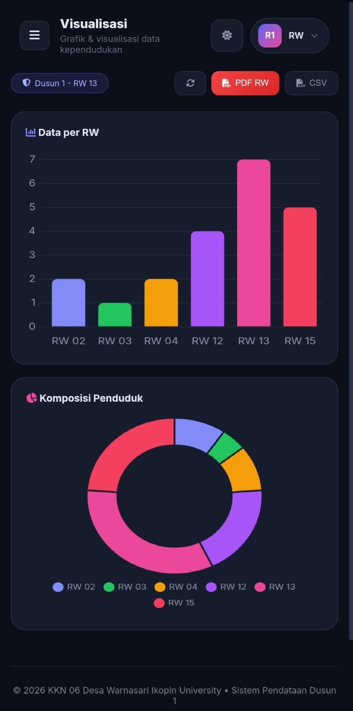
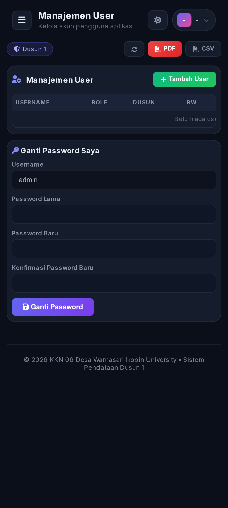

# 📱 Warnasari Data - Aplikasi Pendataan Dusun Digital


---

## 📌 Tentang Proyek

**Warnasari Data** adalah platform digital komprehensif yang dikembangkan dalam rangka **Program KKN (Kuliah Kerja Nyata) KKN 06 Desa Warnasari Ikopin University** untuk mendukung digitalisasi administrasi kependudukan di tingkat dusun/desa.

Aplikasi ini dibangun untuk menggantikan proses pencatatan manual warga yang memakan waktu dan rawan kesalahan, dengan solusi digital yang terintegrasi, efisien, dan mudah digunakan oleh perangkat desa.

> **Konteks:** Digunakan aktif oleh petugas RT/RW di Dusun 1 Warnasari untuk pengelolaan data kependudukan secara digital dan terpusat oleh tim **KKN 06 Desa Warnasari Ikopin University**.

---

## 📸 Tangkapan Layar Aplikasi (Showcase)

| Halaman Login | Dashboard Utama | Scan KK (AI Extraction) |
|:---:|:---:|:---:|
|  |  |  |

| Rekapitulasi Laporan | Grafik Demografi | Hak Akses & Pengguna |
|:---:|:---:|:---:|
|  |  |  |

---

## ✨ Fitur Utama Aplikasi

- **Dashboard Statistik & Demografi:** Menampilkan ringkasan populasi, rasio jenis kelamin, dan statistik demografi secara realtime.
- **Smart Search & Filter RW/RT:** Pencarian data warga cepat berbasis NIK, nama, serta filter tingkatan RT/RW.
- **Manajemen Mutasi Warga:** Pelaporan warga datang, pindah, meninggal dunia, serta pendaftaran bayi baru lahir.
- **Smart Scan KK (AI Extraction):** Fitur pemindaian dan ekstraksi otomatis data Kartu Keluarga untuk mempercepat proses input data.
- **Cetak Laporan & Dokumen:** Fitur eksport cetak laporan bulanan, buku induk warga, dan surat keterangan secara langsung dari aplikasi.
- **Manajemen Pengguna & Hak Akses:** Pengaturan akun pengguna dengan sistem role berdasarkan tingkatan (Admin, Petugas RT, Petugas RW).

---

## 🛠️ Arsitektur & Teknologi

| Komponen | Teknologi | Keterangan |
| :--- | :--- | :--- |
| **Mobile App (Frontend)** | Flutter & Dart | Antarmuka aplikasi mobile Android/Web yang responsif dan fleksibel |
| **Web Portal & Dashboard** | HTML5, CSS3, Chart.js (`Index.html`) | Dashboard antarmuka web interaktif yang di-render oleh Google Apps Script |
| **Backend API & Database** | Google Apps Script (`Code.gs`) | REST API Serverless yang terhubung dengan Google Sheets sebagai database |
| **Konfigurasi GAS** | `appsscript.json` | Manifest hak akses dan konfigurasi lingkungan Google Apps Script |

---

## 🚀 Cara Menjalankan Proyek

### 1. Jalankan Aplikasi Mobile (Flutter)

```bash
# Masuk ke direktori Flutter
cd flutter_app

# Install dependency
flutter pub get

# Jalankan aplikasi di Emulator / Device Android
flutter run
```

### 2. Deploy Backend Google Apps Script

1. Buka [Google Apps Script](https://script.google.com) dan buat project baru.
2. Salin isi file `Code.gs` ke editor GAS.
3. Salin isi file `Index.html` ke file HTML baru di editor GAS.
4. Salin isi `appsscript.json` ke bagian **Manifest** project.
5. Klik **Deploy → New Deployment → Web App**.
6. Atur **Execute as: Me** dan **Who has access: Anyone**.
7. Salin URL deployment yang dihasilkan dan masukkan ke variabel `_initialUrl` di `flutter_app/lib/main.dart`.

---

## 👤 Developer

<table>
  <tr>
    <td align="center">
      <b>RafazaTech</b><br>
      <i>Full Stack Developer — Flutter, Google Apps Script & Web Automation</i><br><br>
      <a href="https://github.com/rafaza24">
        
      </a>
    </td>
  </tr>
</table>

---

## 📝 Lisensi & Hak Cipta

© 2024 **RafazaTech** • **KKN 06 Desa Warnasari Ikopin University**.  
Dikembangkan untuk mendukung digitalisasi dan administrasi pendataan warga dusun secara transparan dan efisien.
